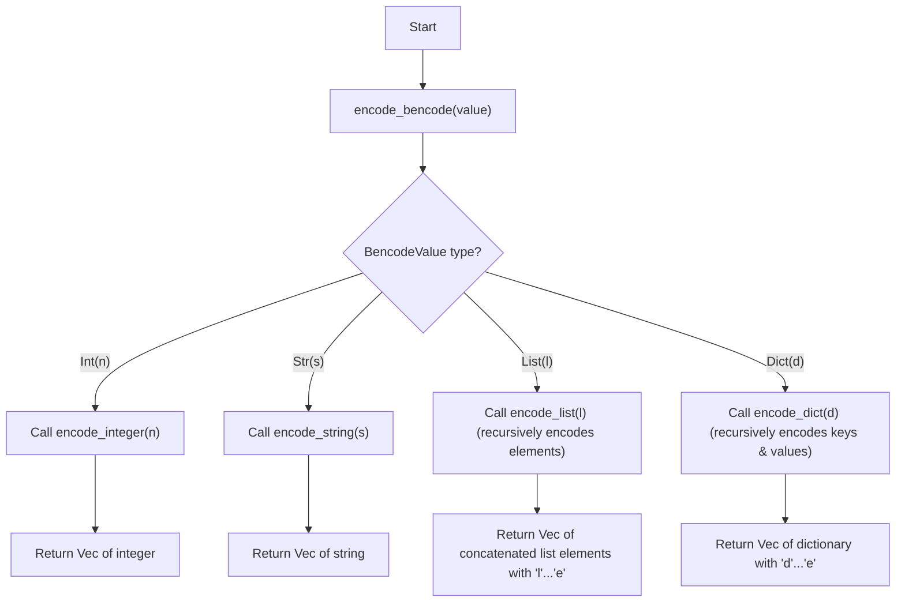
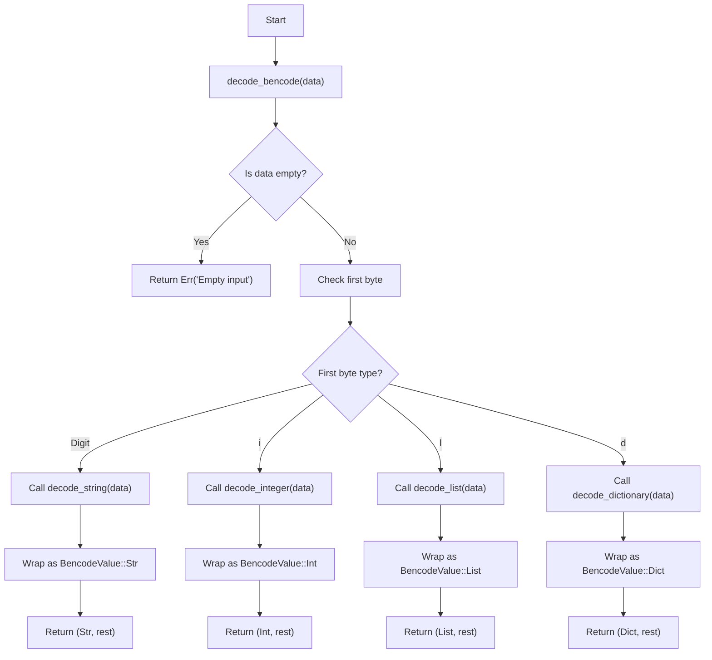

## Encoder

Our current encoder is based on [tagged-union](https://en.wikipedia.org/wiki/Tagged_union) type dispatch via pattern matching

## Decoder

Our current architecture is based on [recursive-descent parser](https://en.wikipedia.org/wiki/Recursive_descent_parser)

!!! info "Future"

    The next generation of the parser might be based on `Zero copy, cursor based Parser`, i will look into it after i create other parts of the project
